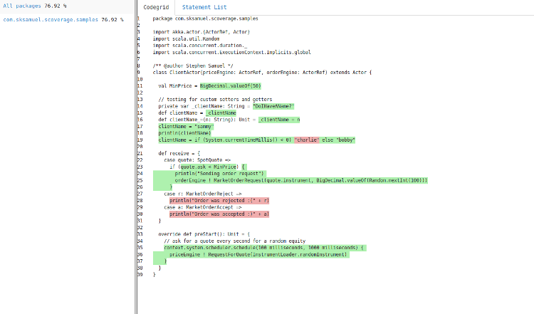

scalac-scoverage-plugin
==========

scoverage is a free Apache licensed code coverage tool for scala that offers statement and branch coverage.
scoverage is available for sbt, maven, and gradle.

[](https://travis-ci.org/scoverage/scalac-scoverage-plugin)
[](http://www.apache.org/licenses/LICENSE-2.0.txt)

[](https://gitter.im/scoverage/scoverage?utm_source=badge&utm_medium=badge&utm_campaign=pr-badge&utm_content=badge)

Join the [scoverage](http://groups.google.com/group/scala-code-coverage-tool)
google group for help, bug reports, feature requests, and general
discussion on scoverage.

To see scoverage in action check out the [samples](https://github.com/scoverage/scoverage-samples) project which shows you covered and non-covered statements, along with upload to coveralls.


### Release History

##### 26th April 2015 1.1.0

* Bug fixes

##### 23rd January 2015 1.0.4

* Improved results in match/cases
* Improved results in partial functions
* Fixed bug in code grid which would render whole sections green
* Improved serializer to handle large projects (no more GC errors)
* Improved handling of guards in for loops

##### 1.0.2

* Fix issue with line spacing in Code Grid report on Windows,

##### 28th November 2014 1.0.1

* Fixed issue with coverageAggregate
* Fixed issue with multi project builds referencing parent code

##### 20th November 2014 1.0.0

* Long awaited multi project support (aggregation)
* Bug fixes for classes with a directory structure different to package name
* Fixed coverage on `new` keyword
* Removed deps on commons-io
* Fixes for empty package names (<empty>)
* Fixed location issue in anon classes
* Enhanced support for constructors
* Changed code grid to use pre instead of table
* Fixed errors with Javascript in Play projects.
* Re-wrote the SBT plugin completely, no longer uses custom config

##### 3rd November 2014 0.99.10

* Fixed command line options due to changes in Scala 2.11.3+

##### 10th Sept 2014 0.99.9

* Added exclude by filename

##### 20th July 2014 0.99.7
* Fixes for final val constants
* Fixed cobertura output for ratio values

##### 21 May 2014 0.99.5

* Major performance enhancements
* Avoids issue with timeouts on tests

##### 19 May 2014 0.99.3

* Fixed issue with min coverage
* Added highlighting option to avoid issues with overlapping trees

##### 15th May 2014 - 0.99.2
* 2.11 support
* [2.10 support dropped](2.10.md)
* Fixes for macro expansion
* Fixes for @unchecked
* Fixes for for-comprehensions
* Min coverage setting
* Performance enhancements (thanks to Richard Bradley)

##### 18th April 2014 - 0.98.2
* Macros are now skipped instead of crashing
* Final vals are corrected measured
* Fixed parallel tests
* Test runner added for compiler
* Pre-compile phase added to run after typer and before namer
* Default parameters are now handled
* Improved handling of multiple measurement data

##### 1st April 2014 - 0.98.0
* Moved to org.scoverage groupId
* Measurement files now thread safe
* Add statement ID to report, to aid debugging (Richard Bradley)
* Add support for coverage exclusion comments (Richard Bradley)

##### 8 March 2014 - 0.95.9
* SBT plugin import issue fixed
* Fixed windows line ending issues
* Use relative href for source view
* Add support for exclude by file name

##### 12th Jan 2014 - 0.95.7
* Fixed bug with return value in pattern match
* Improved support for classname excludes
* Fixed spurious trailing green line breaks

##### 5th Jan 2014 - 0.95.3
* Fixed support for for comprehensions. 
* Optimzed support for nested method calls.
* Fixed exclude package bug
* Now supports nested packages

##### 9th Dec 2013 - 0.95.0
* First stable release.
* Statement level coverage.
* Branch coverage for if, pattern match, partial function.
* HTML Generator.
* Cobertura report generator.

### Statement Coverage

In traditional code coverage tools, line coverage has been the main metric. 
This is fine for languages such as Java which are very verbose and very rarely have more than one
statement per line, and more usually have one statement spread across multiple lines.

In powerful, expressive languages like Scala, quite often multiple statements, or even branches
are included on a single line, eg a very simple example:

```
val status = if (age < 18) "No beer" else "Beer for you"
```

If you had a unit test that ran through the value 18 you would get 100% line coverage
yet you only have 50% statement coverage.

Let's expand this example out to be multifacted, albeit somewhat contrived:

```
val status = if (religion == "Pentecostalist") "Beer forbidden" else if (age < 18) "Underage" else "Beer for you"
```

Now we would get 100% code coverage for passing in the values ("Buddist", 34).

That's why in scoverage we focus on statement coverage, and don't even include line coverage as a metric.
This is a paradigm shift that we hope will take hold.

### Branch Coverage

Branch coverage is very useful to ensure all code paths are covered. Scoverage produces branch coverage metrics
as a percentage of the total branches. Symbols that are deemed as branch statements are:

* If / else statements
* Match statements
* Partial function cases
* Try / catch / finally clauses

In this screenshot you can see the coverage HTML report that shows one branch of the if statement was not
executed during the test run. In addition two of the cases in the partial function were not executed.


### How to use

This project is the base library for instrumenting code via a scalac compiler plugin. To use scoverage in your
project you will need to use one of the build plugins:

* [scoverage-maven-plugin](https://github.com/scoverage/scoverage-maven-plugin)
* [sbt-scoverage](https://github.com/scoverage/sbt-scoverage)
* [gradle-scoverage](https://github.com/scoverage/gradle-scoverage)
* [sbt-coveralls](https://github.com/scoverage/sbt-coveralls)

Scoverage support is available for the following tools:

* [Sonar](https://github.com/RadoBuransky/sonar-scoverage-plugin)
* [Jenkins](https://github.com/jenkinsci/scoverage-plugin)

If you want to write a tool that uses this code coverage library then it is available on maven central.
Search for scalac-scoverage-plugin.

#### Excluding code from coverage stats

You can exclude whole classes or packages by name. Pass a semicolon separated
list of regexes to the 'excludedPackages' option.

For example:
  -P:scoverage:excludedPackages:.*\.utils\..*;.*\.SomeClass;org\.apache\..*

The regular expressions are matched against the fully qualified class name, and must match the entire string to take effect.

Any matched classes will not be instrumented or included in the coverage report.

You can also mark sections of code with comments like:

    // $COVERAGE-OFF$
    ...
    // $COVERAGE-ON$

Any code between two such comments will not be instrumented or included in the coverage report.

Further details are given in the plugin readme's.

## License
```
This software is licensed under the Apache 2 license, quoted below.

Copyright 2013-2015 Stephen Samuel

Licensed under the Apache License, Version 2.0 (the "License"); you may not
use this file except in compliance with the License. You may obtain a copy of
the License at

    http://www.apache.org/licenses/LICENSE-2.0

Unless required by applicable law or agreed to in writing, software
distributed under the License is distributed on an "AS IS" BASIS, WITHOUT
WARRANTIES OR CONDITIONS OF ANY KIND, either express or implied. See the
License for the specific language governing permissions and limitations under
the License.
```
