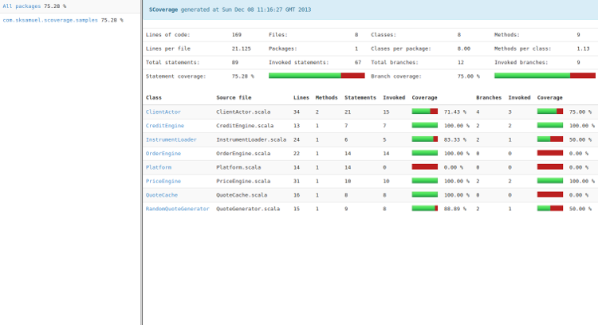
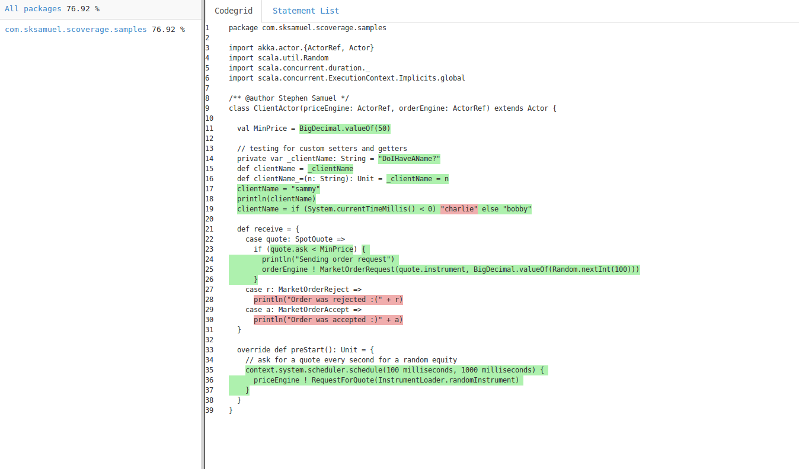

scalac-scoverage-plugin
==========

scoverage is a free Apache licensed code coverage tool for scala that offers statement and branch coverage.
scoverage is available for both maven and sbt.
scoverage was originally based on SCCT.

[](https://travis-ci.org/scoverage/scalac-scoverage-plugin)



### Release History

##### 0.95.3  5/1/2014
* Fixed support for for comprehensions. 
* Optimzed support for nested method calls.
* Fixed exclude package bug
* Now supports nested packages

##### 0.95.0 9/12/2013
* First stable release.
* Statement level coverage.
* Branch coverage for if, pattern match, partial function.
* HTML Generator.
* Cobertura report generator.

### Statement Coverage

In traditional code coverage tools, line coverage has been the main metric. 
This is fine for languages such as Java which are very verbose and very rarely have more than one
statement per line, and more usually have one statement spread across multiple lines.

In powerful, expressive languages like Scala, quite often multiple statements, or even branches
are included on a single line, eg a very simple example:

```
val status = if (age < 18) "No beer" else "Beer for you"
```

If you had a unit test that ran through the value 18 you would get 100% line coverage
yet you only have 50% statement coverage.

Let's expand this example out to be multifacted, albeit somewhat contrived:

```
val status = if (religion == "Pentecostalist") "Beer forbidden" else if (age < 18) "Underage" else "Beer for you"
```

Now we would get 100% code coverage for passing in the values ("Buddist", 34).

That's why in scoverage we focus on statement coverage, and don't even include line coverage as a metric.
This is a paradigm shift that we hope will take hold.

### Branch Coverage

Branch coverage is very useful to ensure all code paths are covered. Scoverage produces branch coverage metrics
as a percentage of the total branches. Symbols that are deemed as branch statements are:

* If / else statements
* Match statements
* Partial function cases
* Try / catch / finally clauses

In this screenshot you can see the coverage HTML report that shows one branch of the if statement was not
executed during the test run. In addition two of the cases in the partial function were not executed.


### How to use

This project is the base library for instrumenting code via a scalac compiler plugin. To use scoverage in your
project you will need to use one of the build plugins:

* [maven-scoverage-plugin](https://github.com/scoverage/maven-scoverage-plugin)
* [sbt-scoverage](https://github.com/scoverage/sbt-scoverage)
* [sbt-coveralls](https://github.com/scoverage/sbt-coveralls)

If you want to write a tool that uses this code coverage library then it is available on maven central.
Search for scalac-scoverage-plugin.

### Alternatives

There are still only a few code coverage tools for Scala. Here are two that we know of:

* [SCCT](http://mtkopone.github.io/scct/) - Offers line coverage
* [Jacoco4sbt](https://github.com/sbt/jacoco4sbt) - Instruments bytecode

## License
```
This software is licensed under the Apache 2 license, quoted below.

Copyright 2013 Stephen Samuel

Licensed under the Apache License, Version 2.0 (the "License"); you may not
use this file except in compliance with the License. You may obtain a copy of
the License at

    http://www.apache.org/licenses/LICENSE-2.0

Unless required by applicable law or agreed to in writing, software
distributed under the License is distributed on an "AS IS" BASIS, WITHOUT
WARRANTIES OR CONDITIONS OF ANY KIND, either express or implied. See the
License for the specific language governing permissions and limitations under
the License.
```
